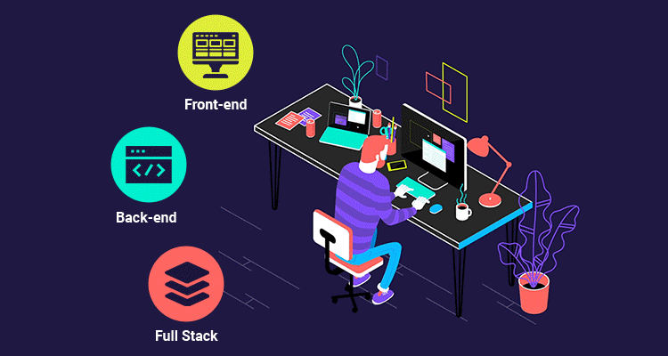
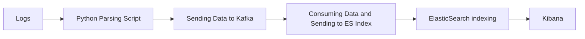
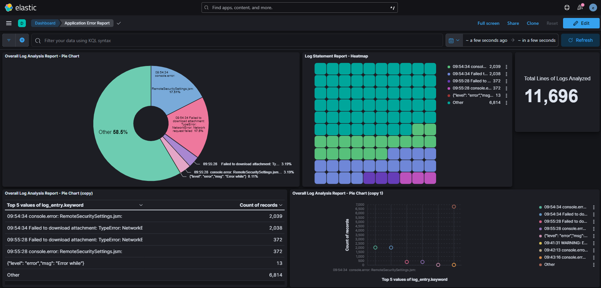
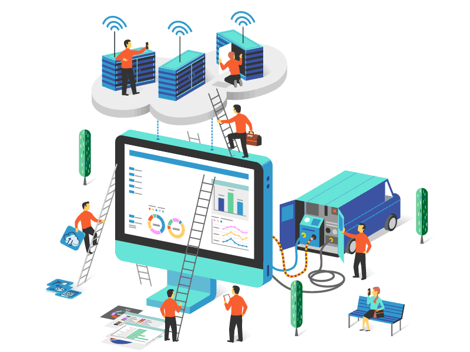
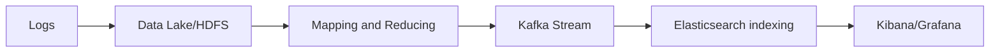

# Distributed Log Analysis Solution

 

 

## Problem Statement

In distributed application environments, developers often struggle to efficiently analyze logs across multiple servers. With each application deployed on different virtual machines (VMs), the task becomes daunting and time-consuming. This results in delayed issue detection, troubleshooting inefficiencies, and increased mean time to resolution (MTTR).

## Solution Overview

Our system offers a centralized platform for log monitoring and analysis, with the goal of simplifying log analysis for developers. The following elements are part of the solution architecture:

This program is designed to be used by developers for post-deployment monitoring and CI/CD automation, with the option to deploy and run during integration testing, whenever the application launches.

1. **Log Collection:** Logs generated by distributed application servers are collected centrally.
2. **Parsing Script:** A Python-based parsing script extracts relevant information from raw log data.
3. **Message Queue (Kafka):** Parsed log data is sent to a Kafka message queue for efficient and reliable data transfer.
4. **Data Processing:** Data from Kafka is processed, mapped, and reduced before being streamed further.
5. **Data Storage (Data Lake/HDFS):** Processed log data is stored in a scalable and fault-tolerant data lake or Hadoop Distributed File System (HDFS).
6. **Consumer:** A consumer application subscribes to the Kafka topic, retrieves log data, and sends it to an Elasticsearch index for indexing and search capabilities.
7. **Visualization Tools (Grafana/Kibana):** Developers can visualize log data using powerful visualization tools like Grafana or Kibana.
   By following the usual instructions, different dashboards based on analysed logs can be configured as failure, success, transactional, and functional based data.

## Current Implementation

- **Log Parsing:** We currently use a Python parsing script to extract relevant information from raw log data.
- **Message Queue:** Parsed log data is sent to a Kafka message queue for efficient data transfer.
- **Data Processing:** Data from Kafka is processed, mapped, and reduced before being streamed further.
- **Data Storage:** Processed log data is stored in an Elasticsearch index for indexing and search capabilities.
- **Visualization:** Developers can visualize log data using Kibana, which provides powerful visualization and dashboarding capabilities.

### Kafka Implementation - Demo

 
### Log Analysis Report - Demo

## Technology and Tech Stack Involved

## Further Enhancement

While our current solution offers significant benefits for log analysis in distributed environments, there are several areas where we can further enhance the platform:

### Advanced Data Processing

Implement advanced data processing techniques, such as machine learning algorithms, for anomaly detection, trend analysis, and predictive analytics. By leveraging machine learning models, we can identify patterns and anomalies in log data more accurately and efficiently.

### Contribution model

We intend to establish a centralized project where developers may work together and provide their contributions to this utility for a range of applications and analysis.

### Real-time Alerts and Notifications

Introduce a mechanism to generate real-time alerts and notifications based on predefined thresholds or anomaly detection algorithms. This feature will enable developers to proactively respond to critical issues before they escalate.

Future Planned Process Flow

 

 

### Enhanced Architecture
The enhanced architecture will leverage a data lake or Hadoop Distributed File System (HDFS) to store raw log data efficiently. Log data will be processed, mapped, and reduced before being streamed to a Kafka message queue for further processing. A dedicated consumer application will subscribe to the Kafka topic, retrieve log data, and send it to an Elasticsearch index for indexing and search capabilities.

### Improved Scalability and Flexibility
By adopting this enhanced architecture, our log analysis solution will become more scalable and flexible. It will be able to handle a larger volume of log data from multiple application servers simultaneously, accommodating the growing needs of our users and adapting to changing business requirements seamlessly. Optimize the platform for scalability and performance to handle growing log volumes and concurrent user access. This includes fine-tuning infrastructure resources, optimizing data processing pipelines, and implementing caching mechanisms for improved response times.

### Integration with External Systems

Extend the solution to integrate with external systems, such as ticketing systems (e.g., Jira) and collaboration platforms (e.g., Slack). This integration will facilitate seamless communication and workflow automation for issue resolution and task assignment.

### Security and Compliance Features

Enhance security and compliance features to ensure data privacy, integrity, and regulatory compliance. Implement role-based access control (RBAC), encryption, and audit logging functionalities to protect sensitive log data and meet industry-specific regulations.

### User Interface (UI) Enhancements

Improve the user interface (UI) to provide a more intuitive and user-friendly experience for developers. This may include customizable dashboards, interactive visualizations, and search capabilities to simplify log exploration and analysis.

### Feedback Mechanism

Establish a feedback mechanism to gather input from developers and stakeholders for continuous improvement. Solicit feedback through surveys, user interviews, and usage analytics to identify pain points and prioritize feature enhancements.

## Benefits

- **Centralized Log Analysis:** Developers no longer need to log in to multiple servers to analyze logs. All log data is available in a single location.
- **Efficient Troubleshooting:** With streamlined log analysis, developers can quickly identify errors and issues, leading to faster troubleshooting and issue resolution.
- **Improved Collaboration:** Centralized log analysis promotes collaboration among team members as everyone has access to the same log data.
- **Enhanced Monitoring:** Real-time monitoring of logs enables proactive detection of issues, preventing potential downtimes and service disruptions.
- **Scalability and Flexibility:** The solution can scale to accommodate growing log volumes and adapt to changing business requirements.

## What We Provide

- **Streamlined Log Analysis:** Our solution provides developers with a seamless and efficient way to analyze logs, saving time and effort.
- **Real-time Insights:** Developers gain real-time insights into application behavior and performance, enabling proactive action.
- **Centralized Platform:** By centralizing log data, developers have a unified view of the entire application ecosystem, simplifying troubleshooting and monitoring.
- **Integration with Visualization Tools:** Integration with popular visualization tools like Grafana and Kibana empowers developers to create insightful dashboards and reports.

## Conclusion

Our solution addresses the challenges faced by developers in analyzing logs across distributed application servers. By providing a centralized platform for log monitoring and analysis, we empower developers to detect and resolve issues faster, leading to improved application reliability and performance.

